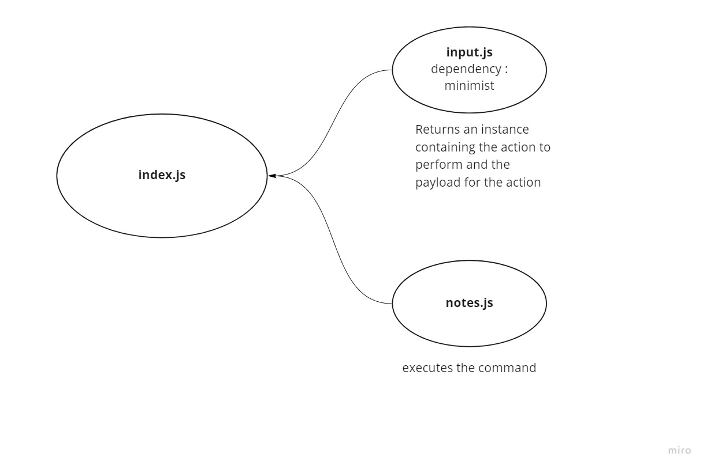

## Project: Notesy

### Author: Abdallah Zakaria

### Setup
- ` node index.js --add "<note>" --category "<type>" `

- ` node index.js --list `

- ` node index.js --list "<type>" `

- ` node index.js --delete <ID>`

#### Run the application 
- Open your Ubuntu terminal

- Clone the repo `https://github.com/Abdallah-Zakaria/notes.git`

- Use the above commands.

#### How to use the library 
- input library 
- notes library 
- This application was build with Node.js and it includes:
  - minimist package
  - dotenv package
  - jest package
  - mongoose package

#### Tests
- Run jest test `npm test`

- Run lint test `npm run lint`

#### UML

